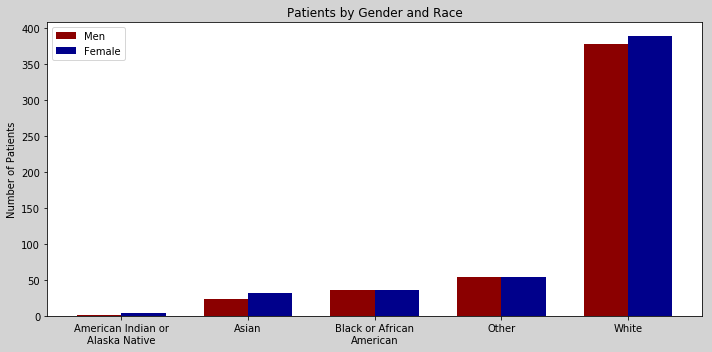
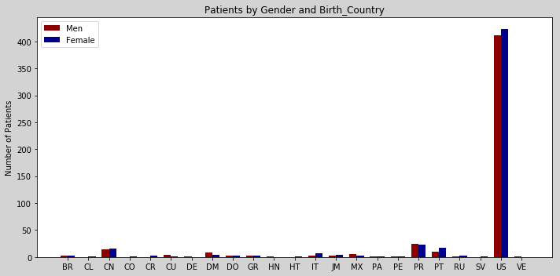
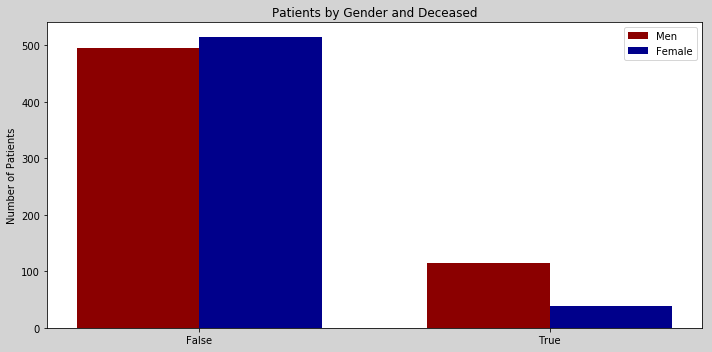
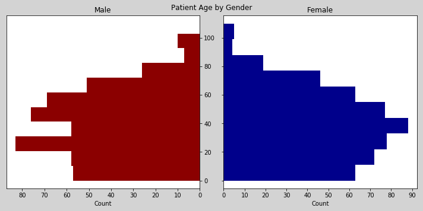
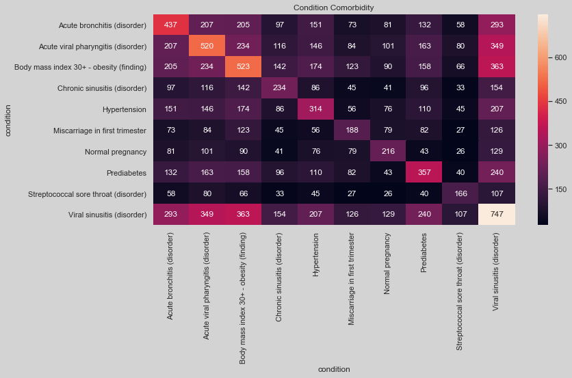

## Description

During this project you will generate, process, analyze, and answer specific questions questions using algorithms and visualizations about a healthcare dataset. Each of the individual assignments will build towards the final deliverable. Individual assignments will have both must have requirements and stretch requirements. Completion of the must have requirements "Meet Expectations". Sophistication, completeness, and style of the stretch requirements will contribute to students "Exceeding Expectations" or delivering "Superior Work".

## Deliverables

1. Assignment 1
    1. Writing console applications
    1. Parsing json and csv with python out of the box
    1. Using 3rd party packages to parse data
2. Assignment 2
    2. Answering basic questions about the data
3. Assignment 3
    3. Data analysis
4. Assignment 4
    4. Data analysis with visualization

### Example Output for Assigment 4 that **Meets Expectations**

